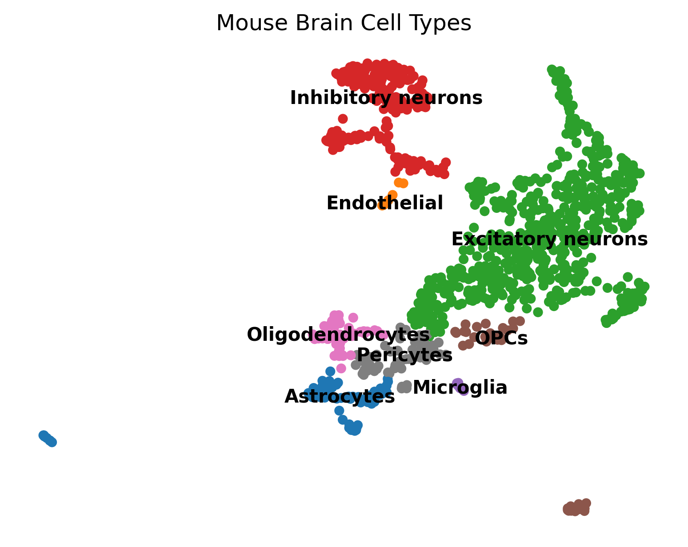
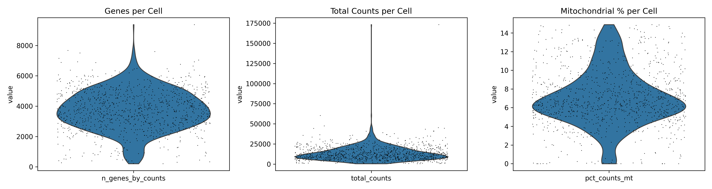
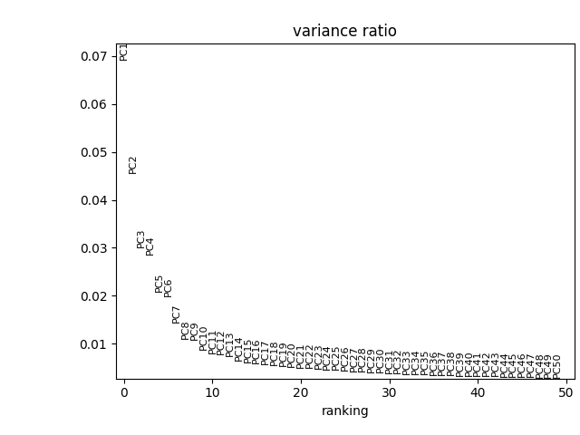

<!DOCTYPE html>
<html lang="en">
<head>
<meta charset="UTF-8">
<meta name="viewport" content="width=device-width, initial-scale=1.0">
<title>umap-my-mind — a config-driven scRNA-seq pipeline, dissected as a case study</title>
<link rel="preconnect" href="https://fonts.googleapis.com">
<link rel="preconnect" href="https://fonts.gstatic.com" crossorigin>
<link href="https://fonts.googleapis.com/css2?family=Fraunces:opsz,wght@9..144,340;9..144,480;9..144,600&family=IBM+Plex+Sans:wght@400;500;600&family=IBM+Plex+Mono:wght@400;500&display=swap" rel="stylesheet">

</head>
<body>

  <nav class="toc" aria-label="Table of contents">
    
CONTENTS

    <ul>
      <li><a href="#overview">1 · Overview</a></li>
      <li><a href="#why">2 · Why this exists</a></li>
      <li><a href="#foundations">3 · Conceptual foundations</a>
        <ul>
          <li><a href="#f-dim">3.1 Dimensionality</a></li>
          <li><a href="#f-umap">3.2 UMAP</a></li>
          <li><a href="#f-leiden">3.3 Leiden</a></li>
          <li><a href="#f-doublet">3.4 Doublets</a></li>
          <li><a href="#f-marker">3.5 Marker scoring</a></li>
          <li><a href="#f-sil">3.6 Silhouette score</a></li>
        </ul>
      </li>
      <li><a href="#architecture">4 · System architecture</a></li>
      <li><a href="#config">5 · Configuration layer</a></li>
      <li><a href="#byod">6 · Bring your own data</a></li>
      <li><a href="#install">7 · Installation</a></li>
      <li><a href="#results">8 · Case study results</a></li>
      <li><a href="#outputs">9 · Output map</a></li>
      <li><a href="#limitations">10 · Limitations</a></li>
      <li><a href="#roadmap">11 · Roadmap</a></li>
      <li><a href="#refs">12 · References</a></li>
      <li><a href="#license">13 · License</a></li>
    </ul>
  </nav>

  <main>

    <header class="hero">
      
bioinformatics case study — single-cell RNA-seq

      <h1>umap-my-mind</h1>
      
An end-to-end, config-driven analysis pipeline for droplet-based scRNA-seq — quality control, doublet removal, resolution-swept Leiden clustering, marker-based cell typing, and automated reporting — run here on real 10x Genomics E18 mouse brain data and documented the way a reviewer would read it.

      

        
1,053cells retained (of 1,301)

        
15,655genes detected

        
8cell types annotated

        
0.9Leiden resolution selected

      

      

        python 3.10+
        license: MIT
        scanpy · leidenalg · scrublet
        status: single-sample prototype
      

    </header>

    <blockquote class="lede-quote">
      This page reads like a lab report, not a product pitch: it explains the biology and math each pipeline stage rests on, narrates what actually happened when it ran on this dataset, and is explicit about what breaks, silently or loudly, when a step is skipped or a config value is wrong. Skip to <a href="#install">§7</a> to just run it.
    </blockquote>

    <section id="overview">
      <h2>1Overview</h2>
      

      
<strong>umap-my-mind</strong> is a single-cell RNA sequencing (scRNA-seq) analysis pipeline built around <a href="https://scanpy.readthedocs.io/" target="_blank" rel="noopener">Scanpy</a>, applied to a public 10x Genomics dataset of E18 mouse brain cells (combined cortex, hippocampus, and subventricular zone). It takes raw droplet-based count data and, without manual gating or notebook-by-notebook fiddling, produces a quality-controlled and doublet-filtered expression matrix, a resolution-swept Leiden clustering, marker-gene-based biological labels for every cluster, eight publication-style 300&nbsp;DPI figures, machine-readable summary tables, a plain-English narrative guide, and a self-contained HTML/PDF report — all from a single command, driven entirely by one YAML file.

      
There is no dataset-specific logic hard-coded into the analysis scripts. Every threshold, path, and marker-gene list lives in <code class="inline">config.yaml</code> or <code class="inline">common.py</code>. This document treats the repository the way a rotation report would: theory first, then the code as a reviewer would read it, then what actually happened on this run, then an honest account of where the implementation is strong and where it's fragile.

    </section>

    <section id="why">
      <h2>2Why this exists</h2>
      

      
Bulk RNA-seq describes a tissue sample by its average gene expression — biologically equivalent to describing a crowd by its average height. Single-cell RNA-seq measures each cell's transcriptome individually, which matters enormously in a tissue like the developing brain, where a single biopsy contains excitatory neurons, inhibitory neurons, radial glia, astrocytes, microglia, oligodendrocyte precursors, and vasculature-associated cells all mixed together — cell types a bulk average would blur into a meaningless composite. Resolving that mixture back into its biological components, without a reference atlas to lean on, is exactly the computational problem this pipeline solves, touching statistics, unsupervised learning, and domain biology in one reproducible artifact.

    </section>

    <section id="foundations">
      <h2>3Conceptual foundations</h2>
      

      
The "why," not the "how" — the how is in §4. Skip ahead if you already live in manifold learning.

      <h3 id="f-dim">3.1 &nbsp;The dimensionality problem in single-cell data</h3>
      
After alignment and counting, each cell is a vector in gene-expression space — here, <strong>15,655 dimensions</strong>, one per detected gene. Two cells of the same type won't have identical vectors: sequencing is a destructive, stochastic sampling process, so two excitatory neurons might disagree on thousands of individual gene counts from technical noise alone, while sharing the same underlying biological program. The entire analytical challenge is separating that shared low-dimensional signal from high-dimensional noise — which is what PCA, then UMAP, then graph clustering do in sequence, at decreasing levels of abstraction.

      <h3 id="f-umap">3.2 &nbsp;UMAP — the manifold-learning core</h3>
      
UMAP (Uniform Manifold Approximation and Projection) is the algorithm the repository is named after, and the algorithm most worth understanding in depth.

      

        
Expand — the full topological argument behind UMAP

        
UMAP rests on the <strong>manifold hypothesis</strong>: that high-dimensional data actually lies near a much lower-dimensional, possibly curved surface embedded in that space. Cellular identity is governed by a comparatively small number of regulatory programs, so cells don't fill the 15,655-dimensional space uniformly — they cluster near a low-dimensional surface shaped by which programs are active.

        
<strong>Stage 1 — build a fuzzy topological representation of the high-dimensional data.</strong> For every cell, UMAP finds its <code class="inline">n_neighbors</code> nearest neighbors (here, in PCA space — §4) and constructs a local metric around each point, rescaled so each point's closest neighbor sits at distance 0, accounting for density varying across the manifold. Each point-neighbor relationship becomes a fuzzy-set membership strength between 0 and 1. These local fuzzy sets are combined across all points via a probabilistic union, yielding one weighted graph over all cells approximating the manifold's topology.

        
<strong>Stage 2 — optimize a low-dimensional layout to match that topology.</strong> UMAP initializes a 2D layout (by default via spectral embedding) and minimizes the cross-entropy between the high-dimensional fuzzy graph and an analogous graph built from 2D distances, via stochastic gradient descent with negative sampling. Pairs connected with high confidence attract; pairs with no edge repel. The <code class="inline">min_dist</code> hyperparameter — not currently exposed in <code class="inline">config.yaml</code>, see §10 — controls how tightly attracted points are allowed to pack.

        
<strong>Why UMAP over t-SNE or PCA here:</strong> PCA is linear, so it can never "unroll" a curved manifold like a continuous maturation trajectory — it's used <em>before</em> UMAP as a fast denoising step, not as the final embedding. t-SNE optimizes a KL divergence with no explicit repulsive counterbalance, which tends to preserve local cluster shape at the cost of relative distances <em>between</em> clusters, and scales worse with cell count. UMAP's cross-entropy construction is a closer approximation to a genuine topological summary, which is why it's become the default in modern single-cell workflows.

        
<strong>What happens if <code class="inline">n_neighbors</code> is wrong:</strong> too low (3–5) and the fuzzy graph is built from noisy relationships, fragmenting the embedding into spurious islands. Too high (100+, on ~1,000 cells) and the graph starts connecting genuinely distinct types, collapsing rare populations — here, the 9-cell microglia and 9-cell endothelial groups are exactly at risk — into the nearest large cluster. This repository uses <code class="inline">n_neighbors: 10</code>, a reasonable middle value, but one never itself swept the way <code class="inline">leiden_resolutions</code> was (§10).

      

      <h3 id="f-leiden">3.3 &nbsp;Leiden community detection</h3>
      
Once cells are a weighted k-nearest-neighbor graph, the pipeline partitions it into discrete communities with the <strong>Leiden algorithm</strong>, the successor to Louvain. Both optimize a modularity-like objective by moving nodes between communities, but Louvain can produce <em>internally disconnected</em> communities — a "cluster" that's actually two unrelated blobs scoring well together as a local-move artifact. Leiden adds a refinement phase guaranteeing every community is well-connected, which matters directly here: a disconnected cluster would get one marker-based label applied to two transcriptionally unrelated groups, silently corrupting downstream cell-type calls. The one free parameter that matters most is <code class="inline">resolution</code> — higher biases toward more, smaller communities. There's no universally correct value, which is exactly why this pipeline sweeps five of them rather than picking one by hand.

      <h3 id="f-doublet">3.4 &nbsp;Doublet detection (Scrublet)</h3>
      
A "doublet" is a single droplet that accidentally captured two cells. Left in the dataset, its mixed RNA profile manifests as a fake "intermediate" population sitting between two genuine clusters in a UMAP, mimicking a transitional cell state that doesn't exist. <strong>Scrublet</strong> detects these computationally: it synthesizes artificial doublets by summing pairs of real cell profiles, embeds real and synthetic cells together, and scores every real cell by how surrounded it is by synthetic doublets in that shared space.

      <h3 id="f-marker">3.5 &nbsp;Marker-gene scoring for cell-typing</h3>
      
Rather than clustering blind and eyeballing marker expression, this pipeline uses <code class="inline">sc.tl.score_genes</code> — Scanpy's implementation of the module-scoring approach from Tirosh et al.'s melanoma scRNA-seq work: every cell's score equals its average marker expression <em>minus</em> the average expression of a randomly chosen, expression-matched control gene set. That subtraction corrects for highly-expressed genes otherwise scoring every cell as suspiciously high from ambient expression alone, not real identity. Each Leiden cluster then receives the label whose average score, across all cells in that cluster, is highest.

      <h3 id="f-sil">3.6 &nbsp;Silhouette score as a model-selection objective</h3>
      
Because five resolutions are tried, something has to pick a winner automatically. This pipeline uses mean <strong>silhouette score</strong>: <code class="inline">(b − a) / max(a, b)</code>, where <code class="inline">a</code> is a cell's average distance to others in its own cluster and <code class="inline">b</code> its average distance to the nearest other cluster. It's a legitimate, standard choice — but it assumes roughly convex, isotropic clusters, a poor fit for continuous developmental trajectories like excitatory-neuron maturation. A trajectory-shaped population will always score "worse" than a true blob of the same size, biasing selection toward splitting continuous populations into more numerous, more convex-looking fragments — visible with real numbers in §8.

    </section>

    <section id="architecture">
      <h2>4System architecture</h2>
      

      
Nine scripts, run in a fixed order by <code class="inline">run_pipeline.py</code>, plus two shared modules — <code class="inline">common.py</code> and <code class="inline">config.yaml</code> — that every stage imports from, so biology and thresholds are defined exactly once.

      

flowchart TD
    CFG["config.yaml + common.py"]
    A["download_data.py — fetch 10x .h5 matrix"] --> B
    B["preprocess.py — Scrublet, QC filter, normalize, log1p"] --> C
    C["cluster.py — HVG, PCA, resolution-swept Leiden, UMAP, marker scoring"] --> D
    D["visualize.py — 7 figures at 300 DPI"] --> E
    E["report.py — analysis_summary.txt"] --> F
    F["generate_narrative_report.py — RESULTS_EXPLAINED.md"] --> G
    G["generate_html_report.py — standalone HTML report"] --> H
    H["convert_html_to_pdf.py — HTML to PDF"] --> I
    I["zip_outputs.py — archive figures/ + results/"]
    CFG -.-> B
    CFG -.-> C
    CFG -.-> D
    CFG -.-> E
      

      <table>
        <thead><tr><th>Script</th><th>Reads</th><th>Writes</th><th>What it does</th></tr></thead>
        <tbody>
          <tr><td><code class="inline">download_data.py</code></td><td>config URL/path</td><td>raw <code class="inline">.h5</code> matrix</td><td>Downloads the 10x matrix if not already on disk.</td></tr>
          <tr><td><code class="inline">preprocess.py</code></td><td>raw matrix</td><td>normalized <code class="inline">.h5ad</code>, QC stats</td><td>Scrublet doublet detection, QC metrics, filtering, normalization, log-transform.</td></tr>
          <tr><td><code class="inline">cluster.py</code></td><td>normalized <code class="inline">.h5ad</code></td><td>processed <code class="inline">.h5ad</code>, resolution sweep, elbow plot</td><td>HVG selection, PCA, five-resolution Leiden sweep scored by silhouette, UMAP, differential expression, marker-based labeling.</td></tr>
          <tr><td><code class="inline">visualize.py</code></td><td>processed <code class="inline">.h5ad</code></td><td>7 figures</td><td>Cluster/cell-type UMAPs, QC violins, QC-metric UMAP, marker dot plot, top-markers panel, single-gene violin.</td></tr>
          <tr><td><code class="inline">report.py</code></td><td>processed <code class="inline">.h5ad</code></td><td><code class="inline">analysis_summary.txt</code></td><td>Neuron-vs-glia composition and top 3 markers per cell type.</td></tr>
          <tr><td><code class="inline">generate_narrative_report.py</code></td><td>static template</td><td><code class="inline">RESULTS_EXPLAINED.md</code></td><td>Plain-English, chapter-by-chapter explanation of every figure.</td></tr>
          <tr><td><code class="inline">generate_html_report.py</code></td><td>summary + 3 of 7 figures</td><td><code class="inline">analysis_report.html</code></td><td>Assembles a self-contained HTML report with images embedded as base64.</td></tr>
          <tr><td><code class="inline">convert_html_to_pdf.py</code></td><td>HTML report</td><td><code class="inline">analysis_report.pdf</code></td><td>Converts the report to PDF via <code class="inline">xhtml2pdf</code>.</td></tr>
          <tr><td><code class="inline">zip_outputs.py</code></td><td><code class="inline">figures/</code>, <code class="inline">results/</code></td><td>timestamped <code class="inline">.zip</code></td><td>Archives every output for hand-off.</td></tr>
        </tbody>
      </table>

      
A detail worth knowing: <code class="inline">report.py</code> and <code class="inline">visualize.py</code> both accept an optional config path as <code class="inline">sys.argv[1]</code>, but explicitly ignore it when it starts with <code class="inline">-f</code> — exactly the flag Jupyter/Colab kernels auto-inject. That guard clause is the load-bearing evidence these scripts were written to also run directly inside a Colab notebook, not only via <code class="inline">run_pipeline.py</code> — a three-environment design intent only partly realized today (§10, §11).

    </section>

    <section id="config">
      <h2>5The configuration layer</h2>
      

      
Every number and path the analysis depends on lives in two files. This table is the honest version — it also marks keys declared but, as of this commit, never actually read (verified against the codebase by grep, not assumed).

      <table>
        <thead><tr><th>Key</th><th>Purpose</th><th>Status</th></tr></thead>
        <tbody>
          <tr><td><code class="inline">data.raw_h5</code> / <code class="inline">raw_mtx_dir</code></td><td>Local paths for the two matrix formats the loader understands</td><td class="status-live">wired</td></tr>
          <tr><td><code class="inline">data.primary_url</code></td><td>URL <code class="inline">download_data.py</code> fetches</td><td class="status-live">wired</td></tr>
          <tr><td><code class="inline">data.raw_tar</code>, <code class="inline">data.backup_url</code></td><td>Implies an archive fallback / mirror URL</td><td class="status-dead">declared, never read — §10</td></tr>
          <tr><td><code class="inline">qc.mt_prefix</code></td><td>Gene-symbol prefix flagging mitochondrial genes (<code class="inline">"mt-"</code>, mouse convention)</td><td class="status-live">wired</td></tr>
          <tr><td><code class="inline">qc.min_genes</code>, <code class="inline">min_cells</code></td><td>Minimum genes/cell and cells/gene for filtering</td><td class="status-live">wired</td></tr>
          <tr><td><code class="inline">qc.mt_threshold</code></td><td>Max % mitochondrial reads per cell</td><td class="status-live">wired</td></tr>
          <tr><td><code class="inline">qc.expected_doublet_rate</code></td><td>Prior fed to Scrublet's simulation</td><td class="status-live">wired</td></tr>
          <tr><td><code class="inline">preprocessing.n_top_genes</code></td><td>Highly variable genes feeding PCA</td><td class="status-live">wired</td></tr>
          <tr><td><code class="inline">preprocessing.scale_max_value</code></td><td>Clip value after z-scaling</td><td class="status-live">wired</td></tr>
          <tr><td><code class="inline">preprocessing.target_sum</code></td><td>Per-cell normalization target</td><td class="status-live">wired</td></tr>
          <tr><td><code class="inline">clustering.n_pca_comps</code></td><td>PCs computed</td><td class="status-live">wired</td></tr>
          <tr><td><code class="inline">clustering.n_neighbors</code>, <code class="inline">n_pcs</code></td><td>Neighbor graph parameters</td><td class="status-live">wired</td></tr>
          <tr><td><code class="inline">clustering.leiden_resolutions</code></td><td>Resolutions swept (§3.3/§8)</td><td class="status-live">wired</td></tr>
          <tr><td><code class="inline">clustering.leiden_flavor</code>, <code class="inline">leiden_iterations</code></td><td>Implies the fast <code class="inline">igraph</code> backend and a fixed iteration count</td><td class="status-dead">declared, never passed to <code class="inline">sc.tl.leiden()</code> — §10</td></tr>
          <tr><td><code class="inline">paths.*</code></td><td>Output directories and processed filename</td><td class="status-live">wired</td></tr>
        </tbody>
      </table>

      
<code class="inline">common.py</code> holds the one piece of configuration that isn't in the YAML at all: the biology.

      <pre><code>MARKER_GENES = {
    "Excitatory neurons": ["Slc17a7", "Neurod6", "Neurod2", "Satb2"],
    "Inhibitory neurons": ["Gad1", "Gad2", "Pvalb", "Sst", "Vip"],
    "Astrocytes": ["Aqp4", "Gfap", "Slc1a3", "Aldh1l1"],
    "Oligodendrocytes": ["Mbp", "Plp1", "Mog", "Olig2"],
    "Microglia": ["Cx3cr1", "P2ry12", "C1qa", "Trem2"],
    "OPCs": ["Pdgfra", "Vcan", "Cspg4"],
    "Endothelial": ["Cldn5", "Pecam1", "Flt1"],
    "Pericytes": ["Pdgfrb", "Acta2", "Rgs5"],
}</code></pre>
      

        what happens if this is wrong for your tissue
        Every downstream label depends on it. <code class="inline">annotate_scored()</code> will always assign the highest-scoring label from this fixed list — run this on liver tissue without editing it, and every cluster still confidently receives one of these eight brain-cell labels, silently, because <code class="inline">score_genes</code> still produces a highest-scoring category even from near-zero, meaningless expression of brain markers in liver cells.
      

    </section>

    <section id="byod">
      <h2>6Bring your own data</h2>
      

      
The concrete "what do I actually change" recipe. Four places, no source-code changes for a same-species, same-format swap.

      <ol>
        <li><strong>Get a 10x-format count matrix.</strong> The loader only understands a filtered feature-barcode <code class="inline">.h5</code> file or an extracted <code class="inline">matrix/barcodes/features</code> directory. Any <a href="https://www.10xgenomics.com/datasets" target="_blank" rel="noopener">10x Genomics public dataset</a> in either format drops in untouched. For anything else (a raw <code class="inline">.h5ad</code>, Loom, or CSV), the one required code change is the three-line <code class="inline">try/except</code> at the bottom of <code class="inline">preprocess.py</code>.</li>
        <li><strong>Point <code class="inline">config.yaml</code>'s <code class="inline">data:</code> block at it</strong> — new <code class="inline">raw_h5</code>/<code class="inline">raw_mtx_dir</code>/<code class="inline">primary_url</code>. <code class="inline">download_data.py</code> fetches it automatically next run.</li>
        <li><strong>Update <code class="inline">qc.mt_prefix</code> for the organism.</strong> Mouse symbols are <code class="inline">Xxxx</code> (hence <code class="inline">"mt-"</code>); human symbols are <code class="inline">ALL-CAPS</code>, needing <code class="inline">"MT-"</code>. Getting this wrong doesn't error — it silently flags zero mitochondrial genes, and the entire membrane-integrity filter does nothing.</li>
        <li><strong>Replace <code class="inline">MARKER_GENES</code></strong> (and <code class="inline">NEURON_TYPES</code>/<code class="inline">GLIA_TYPES</code> if relevant) in <code class="inline">common.py</code> with sets appropriate to the new tissue — the highest-leverage edit, and the one most likely skipped because nothing complains if it isn't.</li>
      </ol>
      
Everything else — QC thresholds, HVG count, PCA/neighbor parameters, the resolution sweep — is tissue-agnostic and can stay at its defaults for a first pass, then be tuned using the same resolution-sweep table §8 uses to judge whether the defaults were reasonable.

    </section>

    <section id="install">
      <h2>7Installation &amp; quickstart</h2>
      

      <h3>7.1 &nbsp;Prerequisites</h3>
      <table>
        <thead><tr><th>Requirement</th><th>Why</th></tr></thead>
        <tbody>
          <tr><td>Python 3.10+</td><td><code class="inline">requirements.txt</code> pins no versions, so pip resolves current <code class="inline">scanpy</code>, which needs Python ≥3.10.</td></tr>
          <tr><td>git</td><td>To clone the repository.</td></tr>
          <tr><td>pip ≥ 23</td><td>Older pip doesn't reliably find binary wheels for <code class="inline">leidenalg</code>/<code class="inline">python-igraph</code>.</td></tr>
          <tr><td>C/C++ toolchain (conditionally)</td><td>Only needed if pip falls back to compiling <code class="inline">leidenalg</code>/<code class="inline">igraph</code> from source — see §7.6.</td></tr>
          <tr><td>Internet at run time</td><td><code class="inline">download_data.py</code> needs it every time the raw matrix isn't already local, not just at install time.</td></tr>
          <tr><td>~500 MB–1 GB free disk</td><td>Raw matrix, two intermediate <code class="inline">.h5ad</code> files, figures, reports, and the final zip.</td></tr>
        </tbody>
      </table>

      <h3>7.2 &nbsp;Step-by-step setup</h3>
      
macOS / Linux

      <pre><code>git clone https://github.com/JOYJIT-06/umap-my-mind.git
cd umap-my-mind
python3 -m venv .venv
source .venv/bin/activate
python -m pip install --upgrade pip
pip install -r requirements.txt</code></pre>

      
Windows (PowerShell)

      <pre><code>git clone https://github.com/JOYJIT-06/umap-my-mind.git
cd umap-my-mind
python -m venv .venv
.venv\Scripts\Activate.ps1
python -m pip install --upgrade pip
pip install -r requirements.txt</code></pre>

      
Conda / mamba (recommended if pip hits a build error, §7.6)

      <pre><code>conda create -n umap-my-mind python=3.11 -y
conda activate umap-my-mind
conda install -c conda-forge python-igraph leidenalg -y
pip install -r requirements.txt</code></pre>

      

        unpinned dependencies — a real reproducibility gap
        <code class="inline">requirements.txt</code> lists bare package names with no version constraints at all. Today's install and next year's will not necessarily match — nothing guarantees this pipeline behaves identically on a machine set up later. Once you have a working environment, run <code class="inline">pip freeze &gt; requirements-lock.txt</code> and commit it alongside <code class="inline">requirements.txt</code>.
      

      <h3>7.3 &nbsp;Verifying the installation</h3>
      <pre><code>python -c "import scanpy as sc, leidenalg, igraph, scrublet, yaml, sklearn, xhtml2pdf; print('scanpy', sc.__version__); print('all imports OK')"</code></pre>

      <h3>7.4 &nbsp;Running the pipeline</h3>
      <pre><code>python run_pipeline.py               # full pipeline, in order

# or run a single stage once its inputs already exist:
python preprocess.py
python cluster.py
python visualize.py</code></pre>
      
<strong>Order matters, and one handoff isn't config-driven.</strong> Every stage's final output path is read from <code class="inline">config.yaml</code> <em>except</em> the intermediate file passed from <code class="inline">preprocess.py</code> to <code class="inline">cluster.py</code> — both hard-code the literal path <code class="inline">data/adata_normalized.h5ad</code>. Running <code class="inline">cluster.py</code> before <code class="inline">preprocess.py</code> has completed raises a plain, easy-to-diagnose <code class="inline">FileNotFoundError</code> — not a silent one. But renaming that file in one script without the other, while adapting the pipeline for new data, would drift silently, with no config value to catch the mismatch.

      <h3>7.5 &nbsp;Expected footprint &amp; runtime</h3>
      
A small dataset (1,301 droplets, 15,655 genes) and CPU-only throughout — no GPU anywhere. On an ordinary laptop, the full pipeline finishes in a couple of minutes; Scrublet's simulation and the five-resolution Leiden sweep are the slowest stages, still each under a minute. Peak memory stays under ~1 GB. None of this holds for a substantially larger dataset via §6 — both scale with cell count.

      <h3>7.6 &nbsp;Troubleshooting</h3>
      <table>
        <thead><tr><th>Symptom</th><th>Cause</th><th>Fix</th></tr></thead>
        <tbody>
          <tr><td>pip fails building <code class="inline">leidenalg</code>/<code class="inline">python-igraph</code>, mentions a missing compiler or CMake</td><td>No pre-built wheel for your Python/OS/architecture</td><td>Upgrade pip first; if that fails, use the conda-forge route in §7.2</td></tr>
          <tr><td><code class="inline">ModuleNotFoundError: No module named 'yaml'</code></td><td>The package is <code class="inline">pyyaml</code>, the import is <code class="inline">yaml</code> — easy to mistake for missing</td><td>Already installed; <code class="inline">import yaml</code> in <code class="inline">common.py</code> is correct</td></tr>
          <tr><td><code class="inline">FileNotFoundError: data/adata_normalized.h5ad</code></td><td><code class="inline">preprocess.py</code> hasn't run yet, or failed earlier in <code class="inline">run_pipeline.py</code></td><td>Run <code class="inline">python preprocess.py</code> first, confirm it prints "Preprocess complete."</td></tr>
          <tr><td><code class="inline">download_data.py</code> hangs or raises <code class="inline">URLError</code></td><td>No internet, a firewall, or the CDN URL changed</td><td>Manually download the <code class="inline">.h5</code> from the <a href="https://www.10xgenomics.com/datasets/1-k-brain-cells-from-an-e-18-mouse-v-3-chemistry-3-standard-3-0-0" target="_blank" rel="noopener">10x dataset page</a> and place it at <code class="inline">data.raw_h5</code> — there's no automatic fallback (§10)</td></tr>
          <tr><td>Behaviour differs from a prior run on identical data</td><td>Unpinned <code class="inline">requirements.txt</code> resolved a newer dependency version</td><td>Use a <code class="inline">requirements-lock.txt</code>, §7.2</td></tr>
        </tbody>
      </table>
    </section>

    <section id="results">
      <h2>8Case study: results from this exact run</h2>
      

      
The <code class="inline">results/</code> and <code class="inline">figures/</code> directories aren't placeholders — they're the actual output on 10x Genomics' <strong>"1k Brain Cells from an E18 Mouse (v3 chemistry)"</strong> dataset: 1,301 droplets sequenced on an Illumina NovaSeq at ~71,000 reads/cell, processed through Cell Ranger 3.0.0, sampled from the combined cortex, hippocampus, and subventricular zone of an embryonic day 18 mouse.

      <h3>QC funnel</h3>
      <table>
        <thead><tr><th>Stage</th><th>Cells</th><th>Genes</th></tr></thead>
        <tbody>
          <tr><td>Raw droplets</td><td>1,301</td><td>—</td></tr>
          <tr><td>After Scrublet doublet removal</td><td>1,300</td><td>—</td></tr>
          <tr><td>After gene/mito filtering</td><td><strong>1,053</strong></td><td><strong>15,655</strong></td></tr>
        </tbody>
      </table>
      
Only <strong>one</strong> droplet out of 1,301 was flagged as a doublet, against an <code class="inline">expected_doublet_rate</code> of 6% (~78 expected). That gap is worth checking rather than accepting at face value — see §10.

      <h3>Resolution sweep</h3>
      <table>
        <thead><tr><th>Resolution</th><th>Clusters found</th><th>Mean silhouette</th></tr></thead>
        <tbody>
          <tr><td>0.3</td><td>11</td><td>0.1192</td></tr>
          <tr><td>0.5</td><td>12</td><td>0.1228</td></tr>
          <tr><td>0.7</td><td>15</td><td>0.1257</td></tr>
          <tr><td><strong>0.9</strong></td><td><strong>18</strong></td><td><strong>0.1427 ← selected</strong></td></tr>
          <tr><td>1.1</td><td>19</td><td>0.1326</td></tr>
        </tbody>
      </table>
      
The pipeline selected resolution 0.9 (18 transcriptional clusters), collapsed by marker scoring into 8 biological labels. Every silhouette value sits between 0.12–0.14 — far from a textbook "well separated" >0.5 — which is expected, not alarming: §3.6 already flagged that silhouette penalizes continuous developmental trajectories, and an E18 brain is, biologically, mid-differentiation.

      <h3>Final composition</h3>
      <table>
        <thead><tr><th>Cell type</th><th>Cells</th><th>% of total</th><th>Top markers</th></tr></thead>
        <tbody>
          <tr><td>Excitatory neurons</td><td>624</td><td>59.3%</td><td><em>Cttnbp2, Meis2, Gria2</em></td></tr>
          <tr><td>Inhibitory neurons</td><td>182</td><td>17.3%</td><td><em>Dlx6os1, Nrxn3, Dlx1</em></td></tr>
          <tr><td>Astrocytes</td><td>68</td><td>6.5%</td><td><em>Dbi, Aldoc, Vim</em></td></tr>
          <tr><td>Pericytes</td><td>68</td><td>6.5%</td><td><em>Dbi, Rps2, Rps10</em></td></tr>
          <tr><td>Oligodendrocytes</td><td>54</td><td>5.1%</td><td><em>Hmgb2, Mki67, Spc24</em></td></tr>
          <tr><td>OPCs</td><td>39</td><td>3.7%</td><td><em>Neurod1, Nfib, Rmst</em></td></tr>
          <tr><td>Endothelial</td><td>9</td><td>0.9%</td><td><em>Itm2a, Sox18, Pglyrp1</em></td></tr>
          <tr><td>Microglia</td><td>9</td><td>0.9%</td><td><em>Tyrobp, Crybb1, Trem2</em></td></tr>
        </tbody>
      </table>
      
A 76.5% neuron / 16.1% glia / 7.3% other split is directionally consistent with E18 cortex/hippocampus/SVZ tissue, where neurogenesis is still active and glial lineages are only beginning to expand. Two rows deserve a second look: "Oligodendrocytes"' top markers (<em>Hmgb2, Mki67, Spc24</em> — all cell-cycle genes, not myelin genes like <em>Mbp</em> or <em>Plp1</em>) look more like actively dividing progenitors than mature oligodendrocytes, and "OPCs"' top markers (<em>Neurod1, Nfib, Rmst</em>) read more like immature neurons than <em>Pdgfra</em>-driven OPCs — plausibly the max-average-score heuristic (§3.5/§10) assigning the closest available label from a fixed eight-category list to proliferating intermediate progenitor cells, a real E18 cell state simply absent from <code class="inline">MARKER_GENES</code>.

      <figure>
        
        <figcaption>Final UMAP embedding colored by assigned cell type. All eight labels occupy visually distinct, non-overlapping regions — a sanity check that marker-scoring produced spatially coherent labels, even where §10 questions the specific label chosen for two of them.</figcaption>
      </figure>
      <figure>
        
        <figcaption>Post-filter distributions of genes/cell, total counts/cell, and % mitochondrial reads. The hard ceiling in the mitochondrial panel at 15% is <code class="inline">qc.mt_threshold</code> being enforced exactly as configured.</figcaption>
      </figure>
      <figure>
        
        <figcaption>Variance explained per principal component. The elbow sits around PC 6–8; <code class="inline">config.yaml</code> nonetheless carries the neighbor graph forward on <code class="inline">n_pcs: 40</code>, well past that elbow.</figcaption>
      </figure>
    </section>

    <section id="outputs">
      <h2>9Output map</h2>
      

      <pre><code>umap-my-mind/
├── data/                          # created at runtime, not checked in
│   ├── &lt;raw 10x matrix&gt;
│   ├── adata_normalized.h5ad      # after preprocess.py
│   └── mouse_brain_processed.h5ad # after cluster.py — the final analysis object
├── figures/                       # 300 DPI PNGs from visualize.py (7 files)
├── results/
│   ├── qc_stats.csv
│   ├── resolution_sweep.csv
│   ├── analysis_summary.txt
│   ├── RESULTS_EXPLAINED.md
│   ├── analysis_report.html
│   └── analysis_report.pdf
└── mouse_brain_analysis_&lt;timestamp&gt;.zip</code></pre>
      
<code class="inline">mouse_brain_processed.h5ad</code> is the most reusable artifact: a standard <a href="https://anndata.readthedocs.io/" target="_blank" rel="noopener">AnnData</a> object with raw and normalized counts, PCA/UMAP coordinates, cluster and cell-type labels, and differential expression results in one file — loadable in Python or R for further custom analysis.

    </section>

    <section id="limitations">
      <h2>10Limitations — a code-level critique</h2>
      

      
Each item was verified against the actual source, not assumed from this document's own claims.

      <ol>
        <li><strong>Two config keys are dead.</strong> <code class="inline">leiden_flavor</code> and <code class="inline">leiden_iterations</code> are defined but never passed into <code class="inline">sc.tl.leiden()</code>. Editing either currently changes nothing.</li>
        <li><strong>The "backup URL" doesn't back anything up.</strong> <code class="inline">backup_url</code>/<code class="inline">raw_tar</code> are declared but never referenced. If the primary URL goes down, the pipeline halts at step 1 with an unhandled <code class="inline">URLError</code>.</li>
        <li><strong>Doublet detection under-called on this run</strong> — 1 flagged against a 6% expectation (~78 expected). Worth inspecting <code class="inline">doublet_score</code> directly (stored but never plotted) rather than assuming the low count means clean data.</li>
        <li><strong>A bare <code class="inline">except:</code> hides load failures</strong> in <code class="inline">preprocess.py</code>'s matrix loader — any error, not just a format mismatch, silently triggers the mtx fallback instead of a diagnosable message.</li>
        <li><strong>Silhouette-based resolution selection is biased toward convex clusters</strong> (§3.6), a poor fit for continuous differentiation trajectories — visible in §8's uniformly low silhouette values and the ambiguous progenitor labels.</li>
        <li><strong>Cell-type labels are per-cluster, not per-cell</strong>, with no confidence score exposed. A cluster with genuine internal heterogeneity is forced into one label — whichever scores highest on average.</li>
        <li><strong><code class="inline">MARKER_GENES</code> is a fixed, eight-category list</strong> with no "none of the above" path — every cluster is forced into the closest of eight boxes regardless of fit.</li>
        <li><strong>No batch integration.</strong> Built for exactly one sample; concatenating multiple runs without Harmony/Scanorama/BBKNN would let sample-of-origin dominate the neighbor graph.</li>
        <li><strong>No ambient RNA or cell-cycle correction</strong> — both known confounders in proliferative tissue like E18 brain, neither addressed before clustering.</li>
        <li><strong>Only 3 of 7 figures reach the shareable report.</strong> The cluster UMAP, elbow plot, QC-metric UMAP, and single-gene violin are computed but never embedded by <code class="inline">generate_html_report.py</code>.</li>
        <li><strong><code class="inline">RESULTS_EXPLAINED.md</code> is a static template</strong>, not generated from the run's actual numbers — it can drift out of sync with the data on a re-run.</li>
        <li><strong>The three-environment design (Colab / local / containerized) is only partly realized</strong> — the Colab-compatible <code class="inline">sys.argv</code> guard exists, but there's no <code class="inline">Snakefile</code> or <code class="inline">Dockerfile</code> in this repository yet.</li>
        <li><strong><code class="inline">requirements.txt</code> is entirely unpinned</strong> — no guarantee this pipeline behaves identically on a machine set up later (§7.2).</li>
      </ol>
    </section>

    <section id="roadmap">
      <h2>11Roadmap / future work</h2>
      

      
Each item responds directly to a numbered limitation above.

      <ul>
        <li>Wire <code class="inline">leiden_flavor</code>/<code class="inline">leiden_iterations</code> into the actual <code class="inline">sc.tl.leiden()</code> call → #1</li>
        <li>Implement the fallback download path already implied by config, with specific exception handling instead of a bare <code class="inline">except:</code> → #2, #4</li>
        <li>Add a doublet-score diagnostic plot and log Scrublet's inferred threshold alongside the configured prior → #3</li>
        <li>Sweep <code class="inline">n_neighbors</code>/<code class="inline">min_dist</code> alongside resolution, and consider a clustering metric less biased toward convex clusters → #5</li>
        <li>Expose per-cell marker-score margins so ambiguous clusters are visibly flagged, not silently force-labeled → #6, #7</li>
        <li>Add a Snakemake workflow and a Dockerfile to complete the three-environment design → #12</li>
        <li>Add a reference-based annotation cross-check (CellTypist, or label transfer from the Allen Brain Cell Atlas) for the ambiguous progenitor populations in §8</li>
        <li>Add ambient-RNA correction (SoupX/CellBender) and cell-cycle regression before clustering → #9</li>
        <li>Embed all seven figures in the HTML report and make the narrative report interpolate live numbers → #10, #11</li>
        <li>Add multi-sample batch integration as an optional branch → #8</li>
        <li>Publish a <code class="inline">requirements-lock.txt</code> for reproducible installs → #13</li>
      </ul>
    </section>

    <section id="refs">
      <h2>12References &amp; further reading</h2>
      

      <ul>
        <li>McInnes, Healy &amp; Melville. <em>UMAP: Uniform Manifold Approximation and Projection for Dimension Reduction.</em> <a href="https://arxiv.org/abs/1802.03426" target="_blank" rel="noopener">arXiv:1802.03426</a></li>
        <li>Traag, Waltman &amp; van Eck. <em>From Louvain to Leiden: guaranteeing well-connected communities.</em> <a href="https://www.nature.com/articles/s41598-019-41695-z" target="_blank" rel="noopener">Scientific Reports, 2019</a></li>
        <li>Wolock, Lopez &amp; Klein. <em>Scrublet: Computational Identification of Cell Doublets in Single-Cell Transcriptomic Data.</em> <a href="https://doi.org/10.1016/j.cels.2018.11.005" target="_blank" rel="noopener">Cell Systems, 2019</a></li>
        <li>Wolf, Angerer &amp; Theis. <em>SCANPY: large-scale single-cell gene expression data analysis.</em> <a href="https://doi.org/10.1186/s13059-017-1382-0" target="_blank" rel="noopener">Genome Biology, 2018</a></li>
        <li>Tirosh et al. <em>Dissecting the multicellular ecosystem of metastatic melanoma by single-cell RNA-seq</em> (source of the module-scoring approach). <a href="https://doi.org/10.1126/science.aad0501" target="_blank" rel="noopener">Science, 2016</a></li>
        <li>Rousseeuw. <em>Silhouettes: A graphical aid to the interpretation and validation of cluster analysis.</em> <a href="https://doi.org/10.1016/0377-0427(87)90125-7" target="_blank" rel="noopener">J. Computational and Applied Mathematics, 1987</a></li>
        <li>10x Genomics. <a href="https://www.10xgenomics.com/datasets/1-k-brain-cells-from-an-e-18-mouse-v-3-chemistry-3-standard-3-0-0" target="_blank" rel="noopener">1k Brain Cells from an E18 Mouse (v3 chemistry) — dataset page</a></li>
      </ul>
      

        scanpy.readthedocs.ioanndata.readthedocs.ioleidenalg.readthedocs.io
      

    </section>

    <section id="license">
      <h2>13License</h2>
      

      
Released under the MIT License.

    </section>

    <footer>
      Built as an MSc Bioinformatics portfolio project — every threshold, marker list, and dataset path lives in one place, and every step is documented for what it does and does not yet do.
    </footer>

  </main>

</body>
</html>
