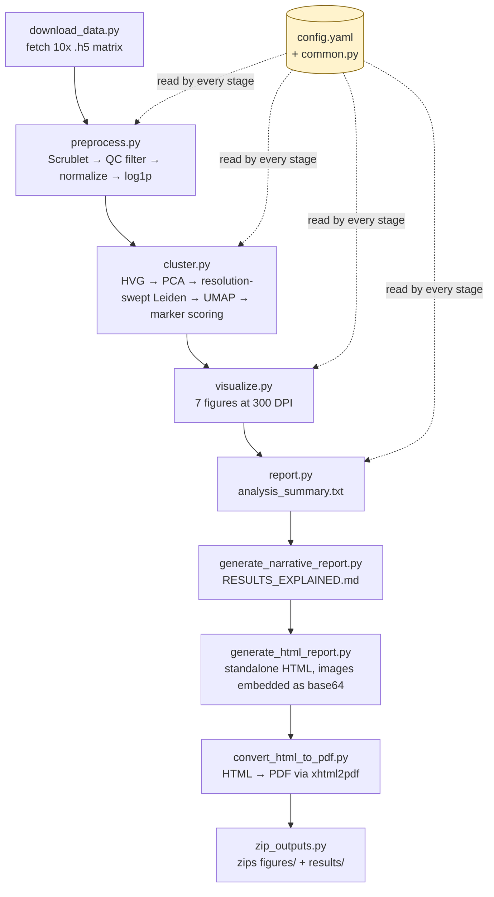

<div align="center">

# 🧠 umap-my-mind

### An end-to-end, config-driven scRNA-seq pipeline — dissected as a case study

*QC → doublet removal → resolution-swept Leiden clustering → marker-based cell-typing → 300 DPI figures → HTML/PDF report, run on real 10x Genomics E18 mouse brain data.*


</div>

---

> **How to read this document.** This isn't a two-paragraph "install and run" README. It's written as a **case study**: it explains the biology and the math the pipeline is standing on, walks through the code the way a reviewer would, tells you exactly which switches to flip to point it at *your own* data, and — just as importantly — is honest about what happens when a step is skipped, misconfigured, or (in a couple of verified places) simply not wired up yet. If you only want to run the thing, jump to [§7 Installation & Quickstart](#7-installation--quickstart). If you want to understand *why* it works the way it does, start at §3.

## Table of Contents

1. [Overview](#1-overview)
2. [Why This Exists](#2-why-this-exists)
3. [Conceptual Foundations](#3-conceptual-foundations)
   - [3.1 The dimensionality problem in single-cell data](#31-the-dimensionality-problem-in-single-cell-data)
   - [3.2 UMAP — the manifold-learning core](#32-umap--the-manifold-learning-core)
   - [3.3 Leiden community detection](#33-leiden-community-detection)
   - [3.4 Doublet detection (Scrublet)](#34-doublet-detection-scrublet)
   - [3.5 Marker-gene scoring for cell-typing](#35-marker-gene-scoring-for-cell-typing)
   - [3.6 Silhouette score as a model-selection objective](#36-silhouette-score-as-a-model-selection-objective)
4. [System Architecture](#4-system-architecture)
5. [The Configuration Layer — `config.yaml` and `common.py`](#5-the-configuration-layer--configyaml-and-commonpy)
6. [Bringing Your Own Data](#6-bringing-your-own-data)
7. [Installation & Quickstart](#7-installation--quickstart)
   - [7.1 Prerequisites](#71-prerequisites)
   - [7.2 Step-by-step setup](#72-step-by-step-setup)
   - [7.3 Verifying the installation](#73-verifying-the-installation)
   - [7.4 Running the pipeline](#74-running-the-pipeline)
   - [7.5 Expected footprint & runtime](#75-expected-footprint--runtime)
   - [7.6 Troubleshooting](#76-troubleshooting)
8. [Case Study: Results From This Exact Run](#8-case-study-results-from-this-exact-run)
9. [Output Map](#9-output-map)
10. [Limitations — a code-level critique](#10-limitations--a-code-level-critique)
11. [Roadmap / Future Work](#11-roadmap--future-work)
12. [References & Further Reading](#12-references--further-reading)
13. [License](#13-license)

---

## 1. Overview

`umap-my-mind` is a single-cell RNA sequencing (scRNA-seq) analysis pipeline built around [Scanpy](https://scanpy.readthedocs.io/), applied to a public 10x Genomics dataset of **E18 mouse brain cells** (combined cortex, hippocampus, and subventricular zone). It takes raw droplet-based count data and, without any manual gating or notebook-by-notebook fiddling, produces:

- a quality-controlled, doublet-filtered, normalized expression matrix,
- a **resolution-swept** Leiden clustering (five resolutions tried automatically, the best one chosen by silhouette score),
- marker-gene-based biological labels for each cluster (excitatory/inhibitory neurons, astrocytes, oligodendrocytes, microglia, OPCs, endothelial cells, pericytes),
- eight publication-style 300 DPI figures,
- a machine-readable summary (`analysis_summary.txt`, `qc_stats.csv`, `resolution_sweep.csv`),
- a plain-English narrative guide for non-specialists,
- a self-contained HTML report with the figures embedded as base64 images, and
- a PDF rendering of that same report,

— all from a single command (`run_pipeline.py`) and all driven by **one YAML file**. There is no dataset-specific logic hard-coded into the analysis scripts; every threshold, every path, and every biological marker list lives in `config.yaml` or `common.py`.

This README treats the repository the way a lab rotation report would: it explains the theory behind each step, narrates what actually happened when the pipeline was run on this dataset, and — because that's the only way to actually evaluate a pipeline — flags exactly where the current implementation is strong, where it's fragile, and where a config value is declared but silently ignored by the code.

## 2. Why This Exists

Bulk RNA-seq gives you the *average* gene expression across thousands of cells in a sample — biologically equivalent to describing a crowd by its average height. Single-cell RNA-seq measures each cell's transcriptome individually, which matters enormously in a tissue like the developing brain, where a single 1-mm³ biopsy contains excitatory neurons, inhibitory neurons, radial glia, astrocytes, microglia, oligodendrocyte precursors, and vasculature-associated cells all mixed together — cell types that a bulk average would blur into a meaningless composite. Resolving that mixture back into its biological components, without a reference atlas to lean on, is exactly the computational problem this pipeline is built to solve, and it's a well-chosen showcase project for a bioinformatics MSc portfolio because it touches statistics (QC thresholds, doublet modeling), unsupervised learning (dimensionality reduction, graph clustering, model selection), and domain biology (marker genes, cortical cell taxonomy) in one coherent, reproducible artifact.

## 3. Conceptual Foundations

This section is the "why," not the "how" — the how is in §4. Skip to §4 if you already live and breathe manifold learning.

### 3.1 The dimensionality problem in single-cell data

After alignment and counting, each cell is a vector in gene-expression space — in this dataset, **15,655 dimensions** (one per detected gene). Two cells of the *same* type will not have identical vectors: sequencing is a destructive, stochastic sampling process (a technique called Poisson/negative-binomial dropout sampling), so two excitatory neurons might disagree on thousands of individual gene counts purely from technical noise, while still sharing the same *underlying* biological program. The entire analytical challenge is separating that shared low-dimensional biological signal from high-dimensional technical noise — which is precisely what PCA, then UMAP, then graph clustering are each doing in sequence, at decreasing levels of abstraction.

### 3.2 UMAP — the manifold-learning core

UMAP (Uniform Manifold Approximation and Projection) is the algorithm the repository is named after, and it deserves the deepest treatment here.

<details>
<summary><b>Expand: the full topological argument behind UMAP</b></summary>

UMAP rests on the **manifold hypothesis**: that high-dimensional data (here, 15,655-dimensional gene expression vectors) actually lies near some much lower-dimensional, possibly curved surface — a manifold — embedded in that high-dimensional space. Cellular identity is governed by a comparatively small number of regulatory programs, so cells don't fill the 15,655-dimensional space uniformly; they cluster near a low-dimensional surface shaped by which programs are active.

UMAP's construction has two stages:

**Stage 1 — Build a fuzzy topological representation of the high-dimensional data.**
For every cell, UMAP finds its `n_neighbors` nearest neighbors (here, on the PCA-reduced space — see §4) and constructs a *local* metric around each point: distances are rescaled so that each point's closest neighbor is at distance 0, using a per-point normalization that accounts for the fact that data density varies across the manifold (some brain-cell neighborhoods are transcriptionally dense, like the large excitatory-neuron population in this dataset; others are sparse, like the nine microglia recovered here). Each point-neighbor relationship becomes a *fuzzy set membership strength* — a number between 0 and 1 representing "how confidently should an edge exist here" — derived from a smooth exponential decay of distance. These local fuzzy simplicial sets are then combined across all points via a fuzzy-set union (a probabilistic OR: an edge's final strength is boosted if *either* of the two points thinks the other is a close neighbor), yielding a single weighted graph over all cells that approximates the manifold's topology.

**Stage 2 — Optimize a low-dimensional layout to match that topology.**
UMAP initializes a 2D layout (by default via spectral embedding of the same graph) and then minimizes the cross-entropy between the high-dimensional fuzzy graph and an analogous fuzzy graph built from the 2D distances, using stochastic gradient descent. Practically: pairs of cells connected with high confidence in step 1 attract each other in the 2D layout; pairs with no edge repel (via negative sampling, for efficiency, rather than computing every non-edge). The `min_dist` hyperparameter (not currently exposed in `config.yaml` — see §10) controls how tightly points are allowed to pack once attracted, which is why UMAP plots show visually tight, well-separated blobs rather than the smoother continuum a pure force-directed layout would produce.

**Why UMAP rather than t-SNE or PCA here:**
- **PCA** is linear — it can only ever find a rotated/scaled subspace, so it cannot "unroll" a curved manifold (e.g., a maturation trajectory where cell state changes continuously). It's used *before* UMAP in this pipeline (§4) precisely as a fast, interpretable denoising step, not as the final embedding.
- **t-SNE** optimizes a KL divergence between high- and low-dimensional neighbor distributions, which, unlike UMAP's cross-entropy, has no explicit repulsive term balancing attraction — in practice this makes t-SNE better at preserving fine local cluster shape but worse at preserving *relative distances between clusters* (global structure), and it scales much worse with cell count. UMAP's construction is also more directly interpretable as an approximation of a genuine topological summary of the data, not just a visualization heuristic — which is why it's become the default in modern single-cell workflows (Scanpy, Seurat, Monocle) since roughly 2018.

**What happens if you get `n_neighbors` wrong:** too low (e.g., 3–5) and the local fuzzy graph is built from very few, noisy neighbor relationships — the embedding fragments into many small, spurious islands that don't correspond to real biology (over-fragmentation). Too high (e.g., 100+ on a dataset of ~1,000 cells, roughly 10% of the entire dataset) and the neighbor graph starts connecting genuinely distinct cell types through the "average" transcriptional profile, collapsing rare populations (here, the 9-cell microglia and 9-cell endothelial groups are exactly the populations at risk) into the nearest large cluster. This repository uses `n_neighbors: 10` for both the resolution sweep and the final embedding — a reasonable middle value for ~1,000 cells, but one that was never itself swept the way `leiden_resolutions` was (see §10).

</details>

### 3.3 Leiden community detection

Once cells are represented as a weighted k-nearest-neighbor graph (the same graph UMAP's Stage 1 builds, in this codebase computed twice — once on the HVG/PCA space for clustering, once again for the final `adata` object before UMAP; see §10), the pipeline needs to partition that graph into discrete communities. It uses the **Leiden algorithm**, the direct successor to the older Louvain algorithm. Both optimize a modularity-like quality function by iteratively moving nodes between communities to increase within-community edge density relative to a random-graph null model, but Louvain has a documented flaw: it can produce **internally disconnected communities** — a "cluster" that is actually two unrelated blobs of cells that happen to score well together on the modularity objective, purely as an artifact of the local-move heuristic. Leiden adds a refinement phase that guarantees every community it outputs is well-connected, which matters directly here: a disconnected "cluster" would get one marker-gene-based biological label (§3.5) applied to two transcriptionally unrelated groups of cells, silently corrupting the downstream cell-type calls.

The single free parameter that matters most is `resolution`: higher values bias the objective toward more, smaller communities; lower values toward fewer, larger ones. There is no universally correct resolution — it depends on how finely the biology in a given tissue is actually structured — which is exactly why this pipeline doesn't pick one value by hand (see the resolution sweep in §4/§8).

### 3.4 Doublet detection (Scrublet)

A "doublet" is a single droplet that, due to imperfect single-cell isolation, accidentally captured two cells instead of one. Its RNA profile is a mixture of both real cell types, and if left in the dataset it manifests as a fake "intermediate" population — for instance, a droplet containing one excitatory neuron and one astrocyte will express markers from both lineages simultaneously and land, in a UMAP, in the empty space *between* the two genuine clusters, mimicking a novel or transitional cell state that doesn't actually exist in the tissue.

**Scrublet** detects these computationally rather than experimentally: it synthesizes thousands of artificial "doublets" by randomly summing pairs of real cell profiles from the dataset, embeds both the real and simulated cells together, and computes a k-nearest-neighbor-based doublet score for every real cell — how surrounded it is by synthetic doublets in that shared space. Cells above a threshold (derived from the bimodal structure of that score distribution, or from the user-supplied `expected_doublet_rate`) are flagged.

### 3.5 Marker-gene scoring for cell-typing

Rather than clustering blind and eyeballing marker expression by hand, this pipeline uses `sc.tl.score_genes` (Scanpy's implementation of the module-scoring approach popularized by Tirosh et al. for tumor scRNA-seq): for each candidate cell type's marker gene list (defined once, centrally, in `common.py`), every cell gets a score equal to its average expression of those markers **minus** the average expression of a randomly chosen, expression-matched control gene set of the same size. That subtraction matters — it corrects for the fact that highly-expressed "housekeeping-adjacent" marker genes would otherwise score every cell as suspiciously high just from ambient expression, not real biological identity. Each Leiden cluster is then assigned the cell-type label whose *average score across all cells in that cluster* is highest.

### 3.6 Silhouette score as a model-selection objective

Because five resolutions are tried, something has to pick the winner automatically. This pipeline uses the mean **silhouette score**: for every cell, `(b − a) / max(a, b)`, where `a` is its average distance (in PCA space) to other cells in its own assigned cluster, and `b` is its average distance to cells in the *nearest other* cluster. It ranges from −1 (badly misassigned) to +1 (perfectly separated), and the resolution with the highest dataset-wide mean is kept.

This is a legitimate, standard choice — but it has a real, checkable weakness discussed with actual numbers in §10: silhouette implicitly assumes roughly convex, isotropic clusters in Euclidean space, which is a good description of well-separated discrete cell types but a poor one for a developing brain, where lineages like excitatory-neuron maturation are *continuous trajectories*, not discrete blobs. A trajectory-shaped population will always look "worse" under silhouette than a true blob of the same size, which biases resolution selection toward splitting continuous populations into more numerous, more convex-looking fragments.

## 4. System Architecture

The pipeline is nine scripts long, run in a fixed order by `run_pipeline.py`, plus two shared modules (`common.py`, `config.yaml`) that every stage imports from — so the biology (marker genes) and the thresholds (QC cutoffs, clustering parameters) are defined in exactly one place, never duplicated across scripts.



| Script | Reads | Writes | What it actually does |
|---|---|---|---|
| `download_data.py` | `config.yaml: data.primary_url, data.raw_h5` | raw `.h5` matrix in `data/` | Downloads the 10x filtered feature-barcode matrix if it isn't already on disk. |
| `preprocess.py` | raw matrix | `data/adata_normalized.h5ad`, `results/qc_stats.csv` | Runs Scrublet doublet detection, computes QC metrics (genes/cell, counts/cell, %mitochondrial), filters cells and genes, normalizes to a fixed total count per cell, and log-transforms. |
| `cluster.py` | `data/adata_normalized.h5ad` | `data/mouse_brain_processed.h5ad`, `results/resolution_sweep.csv`, `figures/pca_elbow_plot.png` | Selects highly variable genes, scales, runs PCA, sweeps five Leiden resolutions and scores each with silhouette, keeps the best, computes UMAP coordinates, runs a Wilcoxon rank-sum differential expression test per cluster, and assigns a biological label to every cluster via marker-gene scoring. |
| `visualize.py` | `data/mouse_brain_processed.h5ad` | 7 figures in `figures/` | Renders the cluster UMAP, the cell-type UMAP, the QC violin plots, a UMAP colored by QC metrics, a marker-gene dot plot, a top-markers-per-cluster panel, and a violin plot of the single top marker gene for the first cluster. |
| `report.py` | `data/mouse_brain_processed.h5ad` | `results/analysis_summary.txt` | Computes neuron-vs-glia composition and the top 3 differential markers per cell type as plain text. |
| `generate_narrative_report.py` | (static template) | `results/RESULTS_EXPLAINED.md` | Writes a fixed, plain-English, chapter-by-chapter explanation of what each figure means — useful for a non-specialist reader, but **not regenerated from the actual run's numbers** (see §10). |
| `generate_html_report.py` | `results/analysis_summary.txt` + 3 of the 7 figures | `results/analysis_report.html` | Assembles a single styled, self-contained HTML file with the chosen figures embedded directly as base64 `` tags (no external file dependencies). |
| `convert_html_to_pdf.py` | `results/analysis_report.html` | `results/analysis_report.pdf` | Converts the HTML report to PDF via `xhtml2pdf`. |
| `zip_outputs.py` | `figures/`, `results/` | `mouse_brain_analysis_<timestamp>.zip` | Archives every output folder for hand-off (e.g., attaching to a CV or portfolio site). |

A detail worth noting for anyone extending this: `report.py` and `visualize.py` both accept an optional config-file path as `sys.argv[1]`, but explicitly ignore it if it starts with `-f` — which is exactly the flag Jupyter/Colab kernels inject into `sys.argv` automatically. That single guard clause is the load-bearing evidence that these scripts were written to also be `%run` or `!python`-invoked directly inside a Colab notebook, not only via `run_pipeline.py` — consistent with a three-environment design intent (notebook / local / containerized), even though only the "local script" mode currently ships in this repository (see §11).

## 5. The Configuration Layer — `config.yaml` and `common.py`

Every number and path the analysis depends on lives in exactly two files. This table is the honest version — it also marks the keys that are declared but, as of this commit, not actually read by any script (verified by grep against the codebase, not assumed).

| Key | Purpose | Status |
|---|---|---|
| `data.raw_h5` / `data.raw_mtx_dir` | Local paths for the two matrix formats `preprocess.py` knows how to read | ✅ wired |
| `data.primary_url` | URL `download_data.py` fetches | ✅ wired |
| `data.raw_tar`, `data.backup_url` | Implies a compressed-archive fallback and a mirror URL | ⚠️ **declared, never read anywhere** — see §10 |
| `qc.mt_prefix` | Gene-symbol prefix used to flag mitochondrial genes (`"mt-"` — lowercase, mouse convention) | ✅ wired |
| `qc.min_genes`, `qc.min_cells` | Minimum genes detected per cell / minimum cells expressing a gene, for filtering | ✅ wired |
| `qc.mt_threshold` | Max allowed % mitochondrial reads per cell (proxy for membrane rupture / cell stress) | ✅ wired |
| `qc.expected_doublet_rate` | Prior fed to Scrublet's simulation | ✅ wired |
| `preprocessing.n_top_genes` | How many highly variable genes feed PCA | ✅ wired |
| `preprocessing.scale_max_value` | Clip value after z-scaling (limits outlier gene influence on PCA) | ✅ wired |
| `preprocessing.target_sum` | Per-cell normalization target (library-size correction) | ✅ wired |
| `clustering.n_pca_comps` | PCs computed | ✅ wired |
| `clustering.n_neighbors`, `clustering.n_pcs` | Neighbor graph parameters for clustering + UMAP | ✅ wired |
| `clustering.leiden_resolutions` | The list swept in §3.6/§4 | ✅ wired |
| `clustering.leiden_flavor`, `clustering.leiden_iterations` | Implies the fast `igraph` backend and a fixed iteration count are used for Leiden | ⚠️ **declared, never passed to `sc.tl.leiden(...)`** — see §10 |
| `paths.*` | Output directories and the final processed `.h5ad` filename | ✅ wired |

`common.py` holds the one piece of configuration that isn't in the YAML at all: the **biology**.

```python
MARKER_GENES = {
    "Excitatory neurons": ["Slc17a7", "Neurod6", "Neurod2", "Satb2"],
    "Inhibitory neurons": ["Gad1", "Gad2", "Pvalb", "Sst", "Vip"],
    "Astrocytes": ["Aqp4", "Gfap", "Slc1a3", "Aldh1l1"],
    "Oligodendrocytes": ["Mbp", "Plp1", "Mog", "Olig2"],
    "Microglia": ["Cx3cr1", "P2ry12", "C1qa", "Trem2"],
    "OPCs": ["Pdgfra", "Vcan", "Cspg4"],
    "Endothelial": ["Cldn5", "Pecam1", "Flt1"],
    "Pericytes": ["Pdgfrb", "Acta2", "Rgs5"],
}
NEURON_TYPES = ["Excitatory neurons", "Inhibitory neurons"]
GLIA_TYPES = ["Astrocytes", "Oligodendrocytes", "Microglia", "OPCs"]
```

**What happens if this dictionary is wrong for your tissue:** every downstream label depends on it — the QC and clustering math don't know or care what tissue they're run on, but `annotate_scored()` in `cluster.py` (§3.5) will *always* assign the highest-scoring label from this fixed list, even if none of the real cell types in your data are represented in it. Run this pipeline on liver tissue without editing `MARKER_GENES`, and every cluster will still confidently receive one of these eight brain-cell labels — silently, with no warning, because `score_genes` will still produce a highest-scoring category even from near-zero, biologically meaningless expression of brain markers in liver cells. This is the single most important file to edit when repurposing the pipeline (§6).

## 6. Bringing Your Own Data

This is the concrete "what do I actually change" recipe. There are exactly **four** places to touch, and no source code needs to change for a same-species, same-format swap.

1. **Get a 10x-format count matrix.** The loader in `preprocess.py` only understands two shapes: a single filtered feature-barcode `.h5` file (`sc.read_10x_h5`) or an extracted `matrix/barcodes/features` directory (`sc.read_10x_mtx`). Any [10x Genomics public dataset](https://www.10xgenomics.com/datasets) in either format will drop in without touching the code. For a non-10x format (e.g., a raw `AnnData`/`.h5ad`, a Loom file, or a plain CSV count matrix), the one code change required is the three-line `try/except` block at the bottom of `preprocess.py` — swap in `sc.read_h5ad(...)`, `sc.read_loom(...)`, or `sc.read_csv(...)` as appropriate.

2. **Point `config.yaml`'s `data:` block at it:**
   ```yaml
   data:
     raw_h5: "data/your_new_dataset_filtered_feature_bc_matrix.h5"
     raw_mtx_dir: "data/your_new_dataset/filtered_feature_bc_matrix/"
     primary_url: "https://your-source/your_new_dataset_filtered_feature_bc_matrix.h5"
   ```
   `download_data.py` will fetch it automatically on the next `run_pipeline.py` call if the local path doesn't already exist.

3. **Update `qc.mt_prefix` for the organism.** Mouse gene symbols are capitalized `Xxxx` (hence `"mt-"`); human gene symbols are `ALL-CAPS` (this needs `"MT-"`). Getting this wrong doesn't error — it silently flags **zero** genes as mitochondrial, `pct_counts_mt` becomes 0 for every cell, and the entire membrane-integrity QC filter (§3.4/§8) does nothing at all.

4. **Replace `MARKER_GENES` (and, if relevant, `NEURON_TYPES`/`GLIA_TYPES`) in `common.py`** with marker sets appropriate to the new tissue — this is the step described in §5 as the single highest-leverage edit, and the one most likely to be skipped by mistake because nothing in the pipeline will complain if it isn't.

Everything else — QC thresholds, HVG count, PCA/neighbor parameters, the resolution sweep — is tissue-agnostic and can be left at its defaults for a first pass, then tuned using the same resolution-sweep table this README uses in §8 to judge whether the defaults were reasonable for the new data.

## 7. Installation & Quickstart

### 7.1 Prerequisites

| Requirement | Why | Notes |
|---|---|---|
| **Python 3.10+** | `requirements.txt` pins no versions, so `pip` resolves the *current* `scanpy` release, and Scanpy's own current releases require Python ≥3.10. | Check with `python --version` before creating the environment — see §7.6 for what happens if this is skipped. |
| **git** | To clone the repository. | — |
| **pip ≥ 23** | Older `pip` releases don't reliably resolve modern binary wheels for `leidenalg`/`python-igraph` (§7.6). | `python -m pip install --upgrade pip` before installing requirements. |
| **A C/C++ build toolchain (conditionally)** | `leidenalg` and `python-igraph` ship pre-built wheels for most common Python/OS/CPU-architecture combinations, but if `pip` can't find one for yours, it falls back to compiling from source. | Only needed if §7.6's build-failure symptom actually occurs — most users on recent CPython on Linux/macOS/Windows x86-64 never hit this. |
| **Internet access at run time, not just install time** | `pip install` needs it once; but `download_data.py` (pipeline stage 1) *also* needs it, every time the raw matrix isn't already sitting in `data/`. | If you're on an offline/air-gapped machine, download the `.h5` file separately and place it at the path in `config.yaml`'s `data.raw_h5` before running. |
| **~500 MB–1 GB free disk** | Raw matrix + two intermediate `.h5ad` files + figures + reports + the final zip archive, for this dataset's size (1,301 cells). | Scales with dataset size if you swap in a larger one (§6). |

### 7.2 Step-by-step setup

**macOS / Linux:**
```bash
git clone https://github.com/JOYJIT-06/umap-my-mind.git
cd umap-my-mind
python3 -m venv .venv
source .venv/bin/activate
python -m pip install --upgrade pip
pip install -r requirements.txt
```

**Windows (PowerShell):**
```powershell
git clone https://github.com/JOYJIT-06/umap-my-mind.git
cd umap-my-mind
python -m venv .venv
.venv\Scripts\Activate.ps1
python -m pip install --upgrade pip
pip install -r requirements.txt
```

**Conda / mamba (recommended if the pip route hits a build error in §7.6):**
```bash
conda create -n umap-my-mind python=3.11 -y
conda activate umap-my-mind
conda install -c conda-forge python-igraph leidenalg -y
pip install -r requirements.txt
```
Installing `python-igraph` and `leidenalg` from `conda-forge` *first* sidesteps the pip wheel-resolution issue entirely, because conda-forge maintains its own pre-compiled builds across platforms (including Apple Silicon) independently of what PyPI happens to have published for your exact interpreter.

**What happens if you skip the virtual environment entirely** and just run `pip install -r requirements.txt` against your system Python: nothing fails immediately, but you're now sharing a single dependency resolution across every other Python project on the machine. Since `requirements.txt` pins no versions (see the callout below), a later `pip install` for an unrelated project can silently upgrade `scanpy`, `pandas`, or `scikit-learn` out from under this pipeline, and a script that worked yesterday can start raising a `TypeError` on an API that changed between minor versions — with no signal in this repository pointing at why.

> **Unpinned dependencies — a real reproducibility gap.** `requirements.txt` lists bare package names (`scanpy`, `leidenalg`, `igraph`, `scrublet`, `pyyaml`, `scikit-learn`, `matplotlib`, `pandas`, `fpdf2`, `xhtml2pdf`) with no version constraints at all. That means today's `pip install -r requirements.txt` and next year's will not necessarily install the same package versions — there is no guarantee this exact pipeline behaves identically on a machine set up a year from now. The fix, once you have a working environment: `pip freeze > requirements-lock.txt` and commit that alongside `requirements.txt`, so anyone (including future-you) can reproduce the exact environment this was validated against.

### 7.3 Verifying the installation

```bash
python -c "import scanpy as sc, leidenalg, igraph, scrublet, yaml, sklearn, xhtml2pdf; print('scanpy', sc.__version__); print('all imports OK')"
```
If this prints a version number and `all imports OK` without a traceback, every dependency the pipeline touches is importable and you're ready to run it.

### 7.4 Running the pipeline

Run the whole thing end to end, in the order `run_pipeline.py` hard-codes (§4):
```bash
python run_pipeline.py
```

Or run any single stage on its own, once its required inputs already exist on disk:
```bash
python preprocess.py
python cluster.py
python visualize.py
```

**Order matters, and one handoff isn't config-driven.** Every stage's *final* output path is read from `config.yaml` (`paths.processed_h5ad`, etc.), **except** the intermediate file passed from `preprocess.py` to `cluster.py`: both scripts hard-code the literal path `data/adata_normalized.h5ad` rather than reading it from `config.yaml`. Practically, this means:
- Running `cluster.py` before `preprocess.py` has ever completed successfully raises a plain `FileNotFoundError: data/adata_normalized.h5ad` — a loud, easy-to-diagnose failure, not a silent one.
- But if you ever rename that intermediate file in one script without updating the other (e.g., while adapting the pipeline for a new dataset per §6), the two scripts will silently drift apart with no config value to catch the mismatch — worth keeping in mind if you extend this pipeline rather than just run it as-is.

Everything else reads from and writes to the paths declared in `config.yaml`, so re-running any stage with the config unchanged simply overwrites that stage's prior outputs in place.

### 7.5 Expected footprint & runtime

This is a small dataset (1,301 droplets, 15,655 genes) and every step is CPU-only — no GPU is used or needed anywhere in this pipeline. On an ordinary laptop CPU, expect the full `run_pipeline.py` to finish in a couple of minutes, with `preprocess.py`'s Scrublet simulation and `cluster.py`'s five-resolution Leiden sweep being the two slowest individual stages (still each well under a minute at this cell count). Peak memory stays under ~1 GB. None of these figures will hold if you swap in a substantially larger dataset via §6 — Scrublet's doublet simulation and the Leiden resolution sweep both scale with cell count, so a 10k- or 100k-cell dataset should be expected to take proportionally longer and use proportionally more memory.

### 7.6 Troubleshooting

| Symptom | Likely cause | Fix |
|---|---|---|
| `pip install` fails while building `leidenalg` or `python-igraph`, mentioning a missing compiler or `CMake` | No pre-built wheel exists on PyPI for your exact Python version / OS / CPU architecture combination, so `pip` fell back to compiling from source | Upgrade `pip` first (`python -m pip install --upgrade pip`) so it can find newer wheels; if that doesn't resolve it, use the conda-forge route in §7.2 instead |
| `ModuleNotFoundError: No module named 'yaml'` even though installation reported success | `pyyaml` is the package name, but the importable module is `yaml` — easy to mistake for a missing dependency when grepping requirements | It's already installed; the import in `common.py` (`import yaml`) is correct as-is |
| `FileNotFoundError: data/adata_normalized.h5ad` when running `cluster.py` directly | `preprocess.py` hasn't been run yet, or failed silently earlier in `run_pipeline.py` (§7.4) | Run `python preprocess.py` first and confirm it prints "Preprocess complete." before retrying `cluster.py` |
| `download_data.py` hangs or raises a `URLError` | No internet access, a corporate proxy/firewall blocking `cf.10xgenomics.com`, or the CDN URL has changed since this was written | Manually download the `.h5` file from the [10x dataset page](https://www.10xgenomics.com/datasets/1-k-brain-cells-from-an-e-18-mouse-v-3-chemistry-3-standard-3-0-0) and place it at the path given in `config.yaml`'s `data.raw_h5` — there is currently no automatic fallback (§10, limitation #2) |
| The pipeline runs, but next month it behaves differently on the same data | Unpinned `requirements.txt` resolved a newer major version of a dependency | Generate and use a `requirements-lock.txt` as described in §7.2 |
| `pip install -r requirements.txt` fails outright because your Python is older than the resolved `scanpy` release supports | Python interpreter below 3.10 (§7.1) | Create the virtual environment with a newer Python (`python3.11 -m venv .venv` or equivalent), or pin an older `scanpy<1.10` explicitly in `requirements.txt` if you must stay on an older interpreter |

## 8. Case Study: Results From This Exact Run

The `results/` and `figures/` directories in this repository are not placeholders — they're the actual output of the pipeline on the 10x Genomics **"1k Brain Cells from an E18 Mouse (v3 chemistry)"** dataset: 1,301 droplets sequenced on an Illumina NovaSeq at ~71,000 reads/cell, processed through Cell Ranger 3.0.0, sampled from the combined cortex, hippocampus, and subventricular zone of an embryonic day 18 mouse.

**QC funnel** (`results/qc_stats.csv`):

| Stage | Cells | Genes |
|---|---|---|
| Raw droplets | 1,301 | — |
| After Scrublet doublet removal | 1,300 | — |
| After gene/mito filtering | **1,053** | **15,655** |

Only **one** droplet out of 1,301 was flagged as a doublet, against an `expected_doublet_rate` of 6% (~78 droplets). That gap is discussed critically in §10 — it's not necessarily a pipeline failure, but it's the kind of number a careful analyst checks rather than accepts at face value.

**Resolution sweep** (`results/resolution_sweep.csv`, computed on the PCA space, `n_pcs=40`):

| Resolution | Clusters found | Mean silhouette |
|---|---|---|
| 0.3 | 11 | 0.1192 |
| 0.5 | 12 | 0.1228 |
| 0.7 | 15 | 0.1257 |
| **0.9** | **18** | **0.1427** ← selected |
| 1.1 | 19 | 0.1326 |

The pipeline automatically selected **resolution 0.9** (18 transcriptional clusters), which the marker-scoring step (§3.5) then collapsed into **8 biological cell-type labels**. Note how *low* every silhouette value is in absolute terms — all sit between 0.12 and 0.14, far from the >0.5 you'd call "well separated" in a generic clustering textbook. That's expected, not alarming, for embryonic brain tissue: §3.6 already flagged that silhouette penalizes continuous developmental trajectories, and an E18 brain is, biologically, mid-differentiation — exactly the regime where you'd expect this.

**Final composition** (`results/analysis_summary.txt`):

| Cell type | Cells | % of total | Top markers |
|---|---|---|---|
| Excitatory neurons | 624 | 59.3% | *Cttnbp2, Meis2, Gria2* |
| Inhibitory neurons | 182 | 17.3% | *Dlx6os1, Nrxn3, Dlx1* |
| Astrocytes | 68 | 6.5% | *Dbi, Aldoc, Vim* |
| Pericytes | 68 | 6.5% | *Dbi, Rps2, Rps10* |
| Oligodendrocytes | 54 | 5.1% | *Hmgb2, Mki67, Spc24* |
| OPCs | 39 | 3.7% | *Neurod1, Nfib, Rmst* |
| Endothelial | 9 | 0.9% | *Itm2a, Sox18, Pglyrp1* |
| Microglia | 9 | 0.9% | *Tyrobp, Crybb1, Trem2* |

**Reading the biology:** a 76.5% neuron / 16.1% glia / 7.3% other split (as `analysis_summary.txt` groups it) is directionally consistent with what's expected of E18 cortex/hippocampus/SVZ tissue, where neurogenesis is still actively ongoing and the glial lineages (astrocytes, oligodendrocytes) are only beginning to expand — but two rows are worth a second look with a trained eye rather than taken at face value: the "Oligodendrocytes" cluster's top markers (*Hmgb2, Mki67, Spc24* — all cell-cycle/proliferation genes, not myelin genes like *Mbp* or *Plp1*) look more like actively **dividing progenitors** than mature oligodendrocytes, and "OPCs" top markers (*Neurod1, Nfib, Rmst*) read more like immature/newborn neurons than *Pdgfra*-driven OPCs. This is a plausible symptom of the max-average-score labeling heuristic in §3.5/§10 assigning the closest available label from a fixed eight-category list to clusters that are actually proliferating intermediate progenitor cells — a cell state genuinely present in E18 brain tissue that simply isn't in `MARKER_GENES` at all.

**Selected figures** (rendered inline from `figures/`, 300 DPI in the repo):


*Figure: final UMAP embedding colored by assigned cell type. Note that all eight labels occupy visually distinct, non-overlapping regions — a qualitative sanity check that the marker-scoring step in §3.5 produced spatially coherent (not scattered/noisy) labels, even where §10 questions the specific label chosen.*


*Figure: post-filter distributions of genes/cell, total counts/cell, and %mitochondrial reads. The hard ceiling visible in the mitochondrial panel at 15% is the `qc.mt_threshold` cutoff being enforced exactly as configured.*


*Figure: variance explained per principal component. The "elbow" — where additional components stop adding much signal — sits around PC 6–8; `config.yaml` nonetheless carries the neighbor graph forward on `n_pcs: 40`, well past that elbow (see §10).*

## 9. Output Map

```
umap-my-mind/
├── data/                          # created at runtime — not checked into the repo
│   ├── <raw 10x matrix>
│   ├── adata_normalized.h5ad      # after preprocess.py
│   └── mouse_brain_processed.h5ad # after cluster.py — the final analysis object
├── figures/                       # 300 DPI PNGs from visualize.py (7 files)
├── results/
│   ├── qc_stats.csv               # from preprocess.py
│   ├── resolution_sweep.csv       # from cluster.py
│   ├── analysis_summary.txt       # from report.py
│   ├── RESULTS_EXPLAINED.md       # from generate_narrative_report.py
│   ├── analysis_report.html       # from generate_html_report.py
│   └── analysis_report.pdf        # from convert_html_to_pdf.py
└── mouse_brain_analysis_<timestamp>.zip   # from zip_outputs.py, archives figures/ + results/
```

The `mouse_brain_processed.h5ad` file is the most reusable artifact here: it's a standard [AnnData](https://anndata.readthedocs.io/) object containing raw and normalized counts, PCA/UMAP coordinates, Leiden and cell-type labels, and differential expression results all in one file — loadable in either Python (`scanpy`) or R (via `zellkonverter`/`SingleCellExperiment`) for further custom analysis beyond what this pipeline itself produces.

## 10. Limitations — a code-level critique

Each item below was verified against the actual source in this repository, not assumed from the README's own claims.

1. **Two config keys are dead.** `clustering.leiden_flavor: "igraph"` and `clustering.leiden_iterations: 2` are defined in `config.yaml` but never passed into the `sc.tl.leiden(...)` call in `cluster.py`. Editing either value currently changes nothing about how the pipeline runs. *What happens if you "fix" this by relying on it anyway:* you'd get Scanpy's default Leiden backend/iteration count silently, not the one the config file claims to be using — a reproducibility gap that would only surface if someone compared a run against the config on paper.

2. **The "backup URL" doesn't back anything up.** `data.backup_url` and `data.raw_tar` are declared but never referenced in `download_data.py` or anywhere else. *What happens if the primary URL goes down:* `download_data.py` raises an unhandled `URLError` and the whole pipeline halts at step 1, despite the config file's structure implying a fallback exists.

3. **Doublet detection under-called on this run.** Scrublet flagged 1 doublet against a configured 6% expectation (~78 expected on 1,301 cells). *What this means if taken at face value:* essentially no doublet filtering happened, and any hybrid-transcriptome artifacts (§3.4) that would normally be caught are still in the 1,053-cell final dataset. This is worth manually inspecting (e.g., plotting `doublet_score` distributions, which are computed and stored in `.obs` but never plotted by `visualize.py`) rather than assuming the low count means the data was simply very clean.

4. **A bare `except:` hides load failures.** `preprocess.py`'s `try: sc.read_10x_h5(...) except: sc.read_10x_mtx(...)` catches *every* exception type — a missing file, a corrupted download, or a permissions error all silently trigger the mtx fallback path instead of surfacing a diagnosable error message, which is confusing at exactly the moment (a broken download) when a clear error would matter most.

5. **Silhouette-based resolution selection has a known bias toward convex clusters** (§3.6), which is a poor fit for the continuous differentiation trajectories present in embryonic tissue — visible in §8's uniformly low (0.12–0.14) silhouette values and in the biologically ambiguous "Oligodendrocytes"/"OPCs" labels discussed there.

6. **Cell-type labels are assigned per-cluster, not per-cell**, with no confidence score exposed downstream. A Leiden cluster containing a genuine mixture of two cell states (plausible in actively differentiating tissue) is forced into a single label — the one with the highest *average* score — discarding the within-cluster heterogeneity that a per-cell or probabilistic (e.g., reference-mapping) approach would preserve.

7. **`MARKER_GENES` is a fixed, hand-curated eight-category list** with no path for "none of the above" or a ninth category (like actively cycling intermediate progenitors, which §8's results plausibly contain). Every cluster gets forced into the closest of eight boxes regardless of fit.

8. **No batch integration.** The pipeline is built for exactly one sample. Pointing it at multiple 10x runs and concatenating them without an integration step (Harmony, Scanorama, BBKNN) would let sample-of-origin, not biology, dominate the neighbor graph and the resulting clusters.

9. **No ambient RNA or cell-cycle correction.** Cross-cell "soup" contamination (correctable with tools like SoupX or CellBender) and cell-cycle-phase-driven variance (correctable with `sc.tl.score_genes_cell_cycle` + regression) are both known confounders in proliferative tissue like E18 brain, and neither is addressed before clustering.

10. **Only 3 of the 7 generated figures make it into the shareable report.** `umap_clusters.png`, `pca_elbow_plot.png`, `umap_qc_metrics.png`, and `top_gene_first_cluster_violin.png` are computed by `visualize.py` but never embedded by `generate_html_report.py` — useful diagnostic material that currently only exists as loose files in `figures/`.

11. **`RESULTS_EXPLAINED.md` is a static template, not generated from the actual run's numbers** — `generate_narrative_report.py` writes a fixed markdown string rather than interpolating the real cluster count, cell counts, or marker genes from `results/analysis_summary.txt`, so it can drift out of sync with the data if the pipeline is re-run on different input.

12. **The three-environment design intent (Colab / local / containerized) is only partially realized.** The `sys.argv[1].startswith("-f")` guard in `report.py`/`visualize.py` (§4) shows the scripts were written to also run inside a notebook kernel, but there is currently no `Snakefile` or `Dockerfile` in this repository to complete the local-orchestration and containerized-reproducibility modes.

## 11. Roadmap / Future Work

Each item here is a direct, one-to-one response to a numbered limitation above.

- [ ] Wire `leiden_flavor` and `leiden_iterations` from `config.yaml` into the actual `sc.tl.leiden(...)` call *(→ #1)*.
- [ ] Implement the fallback download path `backup_url`/`raw_tar` already implies, with a specific `except (URLError, HTTPError)` instead of a bare `except:` *(→ #2, #4)*.
- [ ] Add a doublet-score diagnostic plot to `visualize.py` and log Scrublet's automatically-inferred threshold alongside the configured prior, so an under- or over-call is visible without reading source code *(→ #3)*.
- [ ] Add an `n_neighbors`/`min_dist` sweep alongside the existing resolution sweep, and consider a clustering-metric less biased toward convex clusters (e.g., graph modularity, or, if a reference exists, adjusted Rand index against known labels) *(→ #5)*.
- [ ] Expose per-cell marker-score margins (not just the per-cluster argmax) so ambiguous or mixed clusters are visibly flagged rather than silently force-labeled *(→ #6, #7)*.
- [ ] Add a Snakemake workflow and a Dockerfile to complete the three-environment design already implied by the Colab-compatible `sys.argv` handling *(→ #12)*, matching the Colab / local-Snakemake / Docker modes this project was scoped around.
- [ ] Integrate a reference-based annotation cross-check (e.g., [CellTypist](https://www.celltypist.org/) or label transfer from the [Allen Brain Cell Atlas](https://portal.brain-map.org/)) as a second opinion alongside the hand-curated marker dictionary, particularly for the ambiguous progenitor populations flagged in §8.
- [ ] Add ambient-RNA correction (SoupX/CellBender) and cell-cycle regression before clustering *(→ #9)*.
- [ ] Extend `generate_html_report.py` to embed all seven figures, and make `generate_narrative_report.py` interpolate live numbers from `analysis_summary.txt` instead of shipping a static template *(→ #10, #11)*.
- [ ] Add multi-sample batch integration (Harmony or Scanorama) as an optional pipeline branch for anyone extending this beyond a single 10x run *(→ #8)*.

## 12. References & Further Reading

- McInnes, Healy & Melville. *UMAP: Uniform Manifold Approximation and Projection for Dimension Reduction.* [arXiv:1802.03426](https://arxiv.org/abs/1802.03426)
- Traag, Waltman & van Eck. *From Louvain to Leiden: guaranteeing well-connected communities.* [Scientific Reports, 2019](https://www.nature.com/articles/s41598-019-41695-z)
- Wolock, Lopez & Klein. *Scrublet: Computational Identification of Cell Doublets in Single-Cell Transcriptomic Data.* [Cell Systems, 2019](https://doi.org/10.1016/j.cels.2018.11.005)
- Wolf, Angerer & Theis. *SCANPY: large-scale single-cell gene expression data analysis.* [Genome Biology, 2018](https://doi.org/10.1186/s13059-017-1382-0)
- Tirosh et al. *Dissecting the multicellular ecosystem of metastatic melanoma by single-cell RNA-seq* (source of the module-scoring approach `sc.tl.score_genes` implements). [Science, 2016](https://doi.org/10.1126/science.aad0501)
- Rousseeuw. *Silhouettes: A graphical aid to the interpretation and validation of cluster analysis.* [Journal of Computational and Applied Mathematics, 1987](https://doi.org/10.1016/0377-0427(87)90125-7)
- 10x Genomics. [1k Brain Cells from an E18 Mouse (v3 chemistry) — dataset page](https://www.10xgenomics.com/datasets/1-k-brain-cells-from-an-e-18-mouse-v-3-chemistry-3-standard-3-0-0)
- [Scanpy documentation](https://scanpy.readthedocs.io/) · [AnnData documentation](https://anndata.readthedocs.io/) · [Leiden algorithm (igraph/leidenalg) documentation](https://leidenalg.readthedocs.io/)

## 13. License

Released under the [MIT License](LICENSE).

---

<div align="center">

*Built as an MSc Bioinformatics portfolio project — designed so every threshold, marker list, and dataset path lives in one place, and every step is honest about what it does and does not (yet) do.*

</div>
